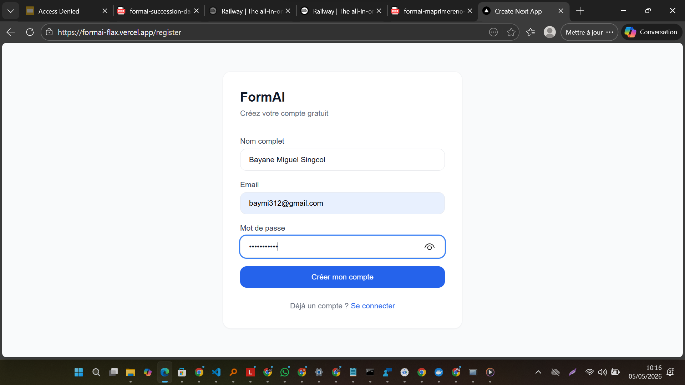
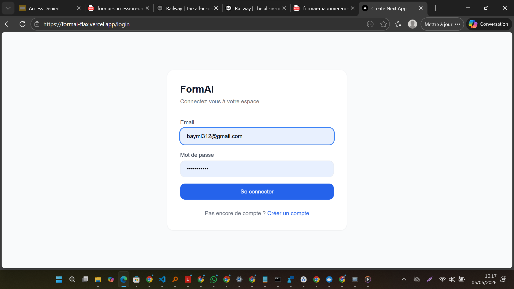
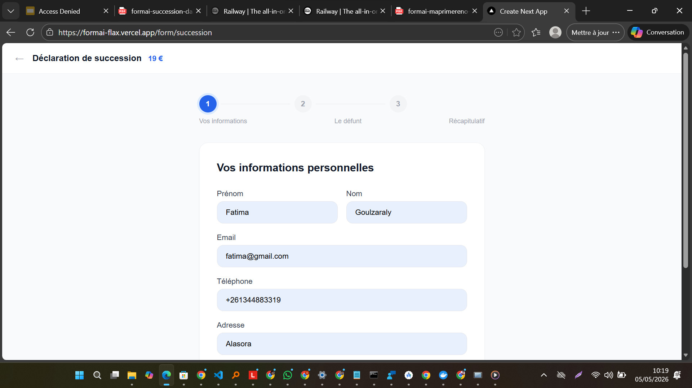
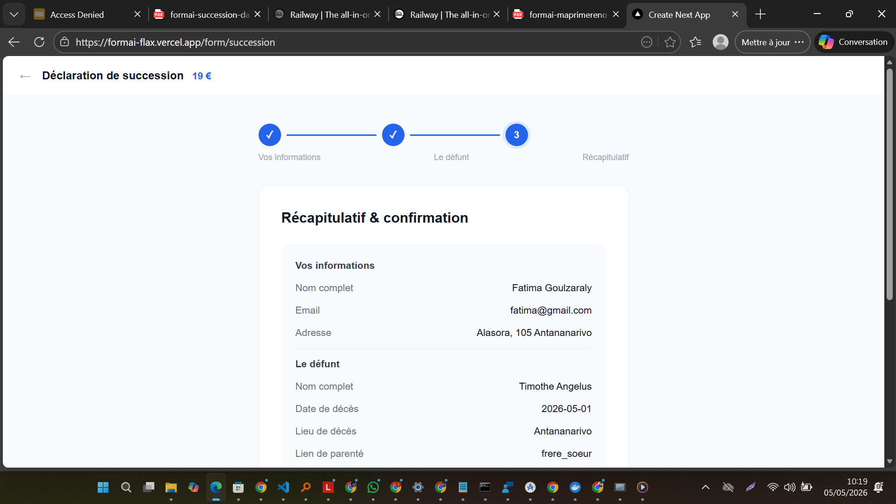
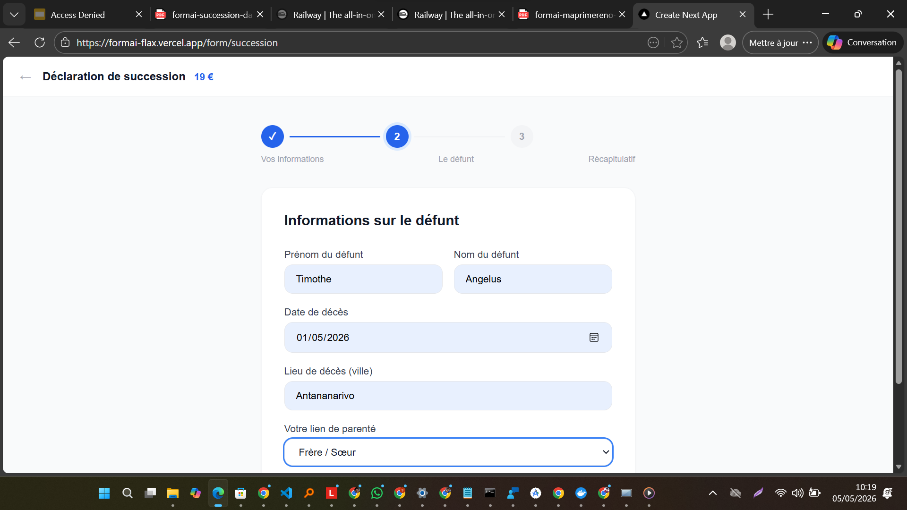
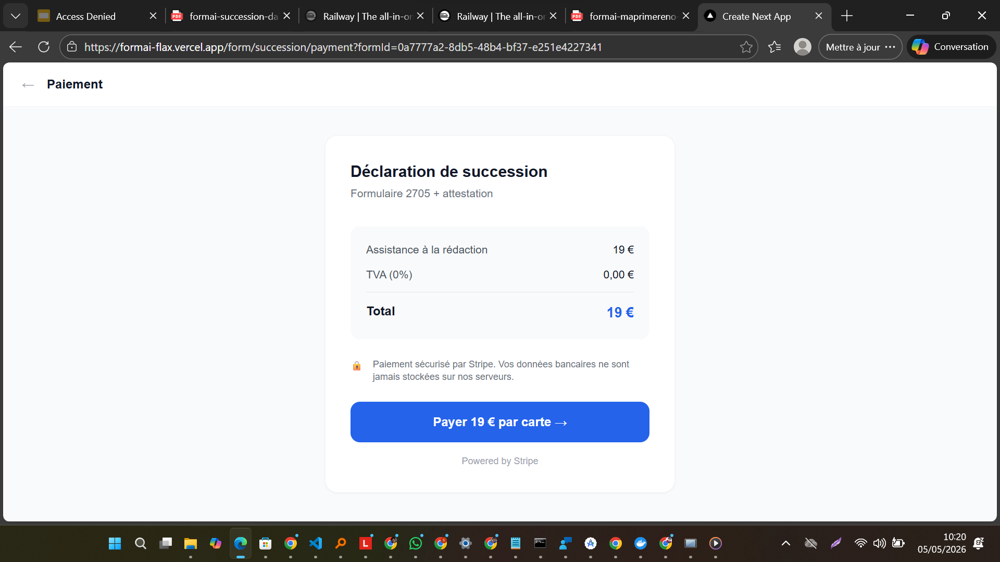
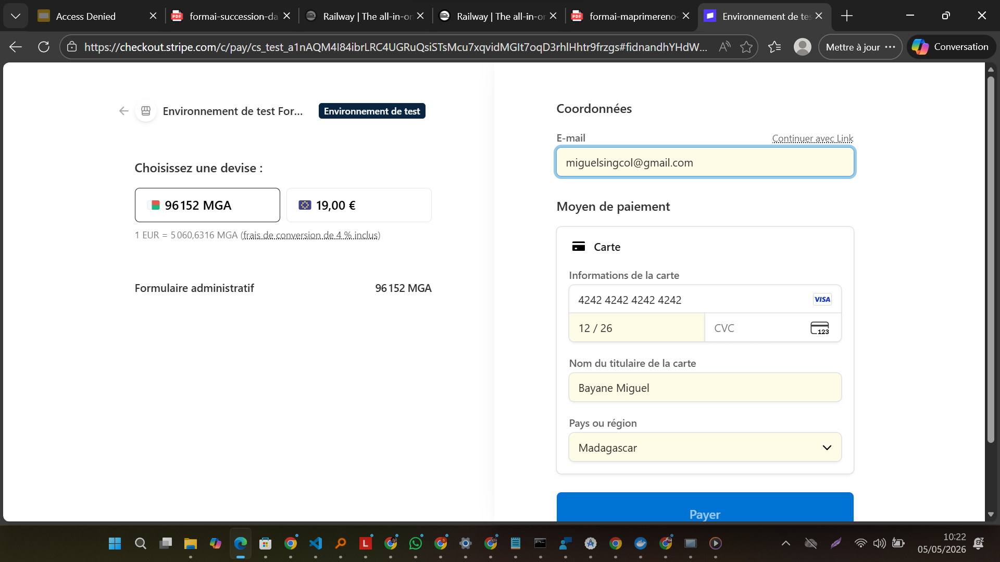
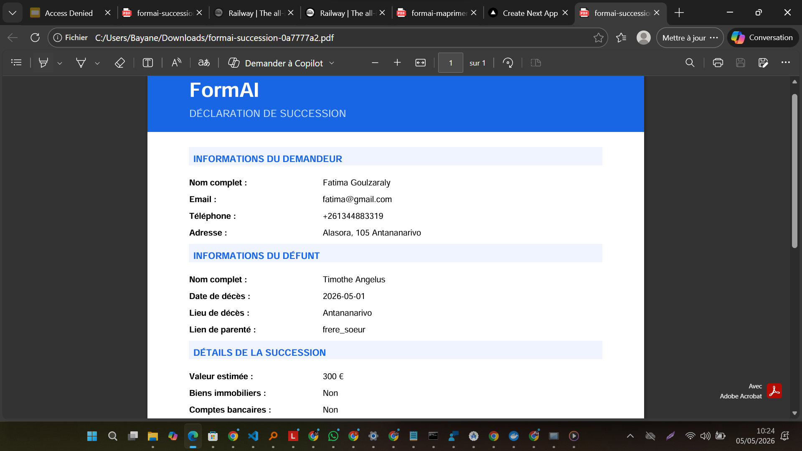

# FormAI — Formulaires administratifs intelligents

> SaaS de génération de formulaires administratifs français avec paiement Stripe, PDF automatique et lettre d'accompagnement générée par IA.

**Live demo** : [formai-flax.vercel.app](https://formai-flax.vercel.app)

## Stack technique

- **Frontend** : Next.js 14 + TypeScript + Tailwind CSS + React Hook Form + Zod
- **Backend** : NestJS + TypeORM + PostgreSQL + JWT Auth
- **Paiement** : Stripe Checkout
- **PDF** : pdf-lib (génération côté serveur)
- **IA** : OpenRouter (Claude 3 Haiku) — lettre d'accompagnement personnalisée
- **Email** : SendGrid
- **Déploiement** : Railway (backend + PostgreSQL) + Vercel (frontend)

## Fonctionnalités

- Wizard 3 étapes adapté par type de formulaire (Succession, Naturalisation, MaPrimeRénov')
- Validation Zod côté client + validation NestJS côté serveur
- Paiement sécurisé Stripe (test : `4242 4242 4242 4242`)
- Génération PDF officiel avec en-tête FormAI
- Lettre d'accompagnement générée par IA (Claude 3 Haiku via OpenRouter)
- Envoi automatique par email (SendGrid)

## Aperçu

### Accueil

### Inscription

### Connexion

### Dashboard

### Formulaire — Étape 1 (Informations personnelles)

### Formulaire — Étape 2 (Succession)

### Formulaire — Étape 2 (Informations défunt)

### Paiement Stripe

### Génération IA

### Résultat lettre IA

### PDF généré

---

Développé par **Bayane Miguel Singcol** · 2026
